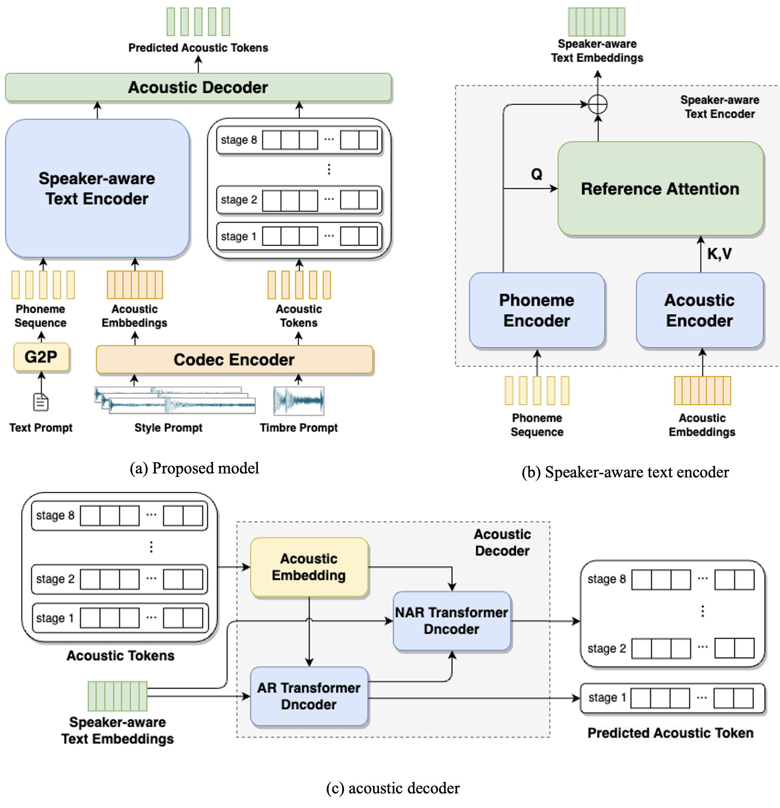

# Abstract

Zero-shot text-to-speech (TTS) synthesis aims to clone any unseen speaker’s voice without adaptation parameters. By quantizing speech waveform into discrete acoustic tokens and modeling these tokens with the language model, recent language model-based TTS models show zero-shot speaker adaptation capabilities with only a 3-second acoustic prompt of an unseen speaker. However, they are limited by the length of the acoustic prompt, which makes it difficult to clone personal speaking style. In this paper, we propose a novel zero-shot TTS model with the multi-scale acoustic prompts based on a neural codec language model VALL-E. A speaker-aware text encoder is proposed to learn the personal speaking style at the phoneme-level from the style prompt consisting of multiple sentences. Following that, a VALL-E based acoustic decoder is utilized to model the timbre from the timbre prompt at the frame-level and generate speech. The experimental results show that our proposed method outperforms baselines in terms of naturalness and speaker similarity, and can achieve better performance by scaling out to a longer style prompt.

    
  	 
    
 Fig.1: The architecture of the proposed model. 

# Subjective Evaluation

To demonstrate the performance of our proposed method, some samples are provided for comparison. **GT (Reconstructed)** means the audio reconstructed from ground truth speech by the EnCodec model. **VALL-E** means an open-source implementation of VALL-E. **Proposed** means the proposed model, which considers both a 3-second timbre prompt and a style prompt consisting of ten sentences. **Proposed-3s** means the baseline model, which shares the same structure and parameters as the proposed model, but only uses a 3-second speech as both timbre prompt and style prompt. **Base-S** means the style prompt-only baseline model, which shares the same TTS backbone and style prompt as the proposed model, but excludes the timbre prompt. **Base-T** means the timbre prompt-only baseline model, which shares the same TTS backbone and timbre prompt as the proposed model, but the style prompt is removed. In addition, a pre-trained neural audio codec model, EnCodec, is utilized to generate the waveform.

| Target Text | GT (Reconstructed) | VALL-E | Proposed | Proposed-3s | Base-S | Base-T |
| :---- | :---- | :---- | :---- | :---- | ----- | ----- |
| Also, a draft on futurity, sometimes honored, but generally extended. | <audio controls><source src="./wavs/gt/1.wav" type="audio/wav">Your browser does not support the audio element.</audio> | <audio controls><source src="./wavs/valle/1.wav" type="audio/wav">Your browser does not support the audio element.</audio> | <audio controls><source src="./wavs/proposed/1.wav" type="audio/wav">Your browser does not support the audio element.</audio> | <audio controls><source src="./wavs/proposed3s/1.wav" type="audio/wav">Your browser does not support the audio element.</audio> | <audio controls><source src="./wavs/style/1.wav" type="audio/wav">Your browser does not support the audio element.</audio> | <audio controls><source src="./wavs/timbre/1.wav" type="audio/wav">Your browser does not support the audio element.</audio> |
| And yet, what cause was there for anger? | <audio controls><source src="./wavs/gt/2.wav" type="audio/wav">Your browser does not support the audio element.</audio> | <audio controls><source src="./wavs/valle/2.wav" type="audio/wav">Your browser does not support the audio element.</audio> | <audio controls><source src="./wavs/proposed/2.wav" type="audio/wav">Your browser does not support the audio element.</audio> | <audio controls><source src="./wavs/proposed3s/2.wav" type="audio/wav">Your browser does not support the audio element.</audio> | <audio controls><source src="./wavs/style/2.wav" type="audio/wav">Your browser does not support the audio element.</audio> | <audio controls><source src="./wavs/timbre/2.wav" type="audio/wav">Your browser does not support the audio element.</audio> |
| Perhaps the profession of doing good may be full, but every body should be kind at least to himself. | <audio controls><source src="./wavs/gt/3.wav" type="audio/wav">Your browser does not support the audio element.</audio> | <audio controls><source src="./wavs/valle/3.wav" type="audio/wav">Your browser does not support the audio element.</audio> | <audio controls><source src="./wavs/proposed/3.wav" type="audio/wav">Your browser does not support the audio element.</audio> | <audio controls><source src="./wavs/proposed3s/3.wav" type="audio/wav">Your browser does not support the audio element.</audio> | <audio controls><source src="./wavs/style/3.wav" type="audio/wav">Your browser does not support the audio element.</audio> | <audio controls><source src="./wavs/timbre/3.wav" type="audio/wav">Your browser does not support the audio element.</audio> |
| Tie them down with bladder, and in a few days they will be fit for use. | <audio controls><source src="./wavs/gt/4.wav" type="audio/wav">Your browser does not support the audio element.</audio> | <audio controls><source src="./wavs/valle/4.wav" type="audio/wav">Your browser does not support the audio element.</audio> | <audio controls><source src="./wavs/proposed/4.wav" type="audio/wav">Your browser does not support the audio element.</audio> | <audio controls><source src="./wavs/proposed3s/4.wav" type="audio/wav">Your browser does not support the audio element.</audio> | <audio controls><source src="./wavs/style/4.wav" type="audio/wav">Your browser does not support the audio element.</audio> | <audio controls><source src="./wavs/timbre/4.wav" type="audio/wav">Your browser does not support the audio element.</audio> |
| He isn't fit to hear what's said here. | <audio controls><source src="./wavs/gt/5.wav" type="audio/wav">Your browser does not support the audio element.</audio> | <audio controls><source src="./wavs/valle/5.wav" type="audio/wav">Your browser does not support the audio element.</audio> | <audio controls><source src="./wavs/proposed/5.wav" type="audio/wav">Your browser does not support the audio element.</audio> | <audio controls><source src="./wavs/proposed3s/5.wav" type="audio/wav">Your browser does not support the audio element.</audio> | <audio controls><source src="./wavs/style/5.wav" type="audio/wav">Your browser does not support the audio element.</audio> | <audio controls><source src="./wavs/timbre/5.wav" type="audio/wav">Your browser does not support the audio element.</audio> |
| He was young; no spear had touched him, no poison lurked in his wine. | <audio controls><source src="./wavs/gt/6.wav" type="audio/wav">Your browser does not support the audio element.</audio> | <audio controls><source src="./wavs/valle/6.wav" type="audio/wav">Your browser does not support the audio element.</audio> | <audio controls><source src="./wavs/proposed/6.wav" type="audio/wav">Your browser does not support the audio element.</audio> | <audio controls><source src="./wavs/proposed3s/6.wav" type="audio/wav">Your browser does not support the audio element.</audio> | <audio controls><source src="./wavs/style/6.wav" type="audio/wav">Your browser does not support the audio element.</audio> | <audio controls><source src="./wavs/timbre/6.wav" type="audio/wav">Your browser does not support the audio element.</audio> |

# Investigation

To investigate the impact of the prompt with different lengths, we adjust the length of the acoustic prompt and style prompt for VALLE and the proposed model, respectively. For VALL-E, constrained by the structure of the decoder-only language model, we randomly select two utterances of 3s/6s as the prompts for each speaker. We also evaluate our proposed model with various numbers of speech as the style prompt, including 1 sentence, 5 sentences, 10 sentences and 20 sentences. The average duration of sentences is about 6 seconds. The timbre prompt is fixed to a 3-second speech as mentioned above. In particular, when the style prompt consists of only one sentence, the proposed model only uses a 3-second speech as both the timbre prompt and style prompt.

| Target Text                                                  | GT (Reconstructed)                                           | VALL-E w/ 3s                                                 | VALL-E w/ 6s                                                 | Proposed w/ 1 sent (3s)                                      | Proposed w/ 5 sent (30s)                                     | Proposed w/ 10 sent (1min)                                   | Proposed w/ 20 sent (2min)                                   |
| :----------------------------------------------------------- | :----------------------------------------------------------- | :----------------------------------------------------------- | :----------------------------------------------------------- | :----------------------------------------------------------- | ------------------------------------------------------------ | ------------------------------------------------------------ | ------------------------------------------------------------ |
| Had she not been assisted?                                   | <audio controls><source src="./wavs/gt/7.wav" type="audio/wav">Your browser does not support the audio element.</audio> | <audio controls><source src="./wavs/valle3s/1.wav" type="audio/wav">Your browser does not support the audio element.</audio> | <audio controls><source src="./wavs/valle6s/1.wav" type="audio/wav">Your browser does not support the audio element.</audio> | <audio controls><source src="./wavs/propose1s/1.wav" type="audio/wav">Your browser does not support the audio element.</audio> | <audio controls><source src="./wavs/propose5s/1.wav" type="audio/wav">Your browser does not support the audio element.</audio> | <audio controls><source src="./wavs/propose10s/1.wav" type="audio/wav">Your browser does not support the audio element.</audio> | <audio controls><source src="./wavs/propose20s/1.wav" type="audio/wav">Your browser does not support the audio element.</audio> |
| "Take it of course," says gringo, "take anything that offers, why not?" | <audio controls><source src="./wavs/gt/8.wav" type="audio/wav">Your browser does not support the audio element.</audio> | <audio controls><source src="./wavs/valle3s/2.wav" type="audio/wav">Your browser does not support the audio element.</audio> | <audio controls><source src="./wavs/valle6s/2.wav" type="audio/wav">Your browser does not support the audio element.</audio> | <audio controls><source src="./wavs/propose1s/2.wav" type="audio/wav">Your browser does not support the audio element.</audio> | <audio controls><source src="./wavs/propose5s/2.wav" type="audio/wav">Your browser does not support the audio element.</audio> | <audio controls><source src="./wavs/propose10s/2.wav" type="audio/wav">Your browser does not support the audio element.</audio> | <audio controls><source src="./wavs/propose20s/2.wav" type="audio/wav">Your browser does not support the audio element.</audio> |
| Changes many and great followed in bewildering succession in utah. | <audio controls><source src="./wavs/gt/9.wav" type="audio/wav">Your browser does not support the audio element.</audio> | <audio controls><source src="./wavs/valle3s/3.wav" type="audio/wav">Your browser does not support the audio element.</audio> | <audio controls><source src="./wavs/valle6s/3.wav" type="audio/wav">Your browser does not support the audio element.</audio> | <audio controls><source src="./wavs/propose1s/3.wav" type="audio/wav">Your browser does not support the audio element.</audio> | <audio controls><source src="./wavs/propose5s/3.wav" type="audio/wav">Your browser does not support the audio element.</audio> | <audio controls><source src="./wavs/propose10s/3.wav" type="audio/wav">Your browser does not support the audio element.</audio> | <audio controls><source src="./wavs/propose20s/3.wav" type="audio/wav">Your browser does not support the audio element.</audio> |

# Comparison with Official VALL-E

In this section, we directly download samples for the LibriSpeech dataset from the VALL-E demo page, and compare them with the speech samples generated by our proposed model. It is noteworthy that the official VALL-E model is trained on the Librilight dataset contains 60k hours of recordings, and our proposed model is trained only on the LibriSpeech dataset contains approximately 580h hours of recordings.

| Target Text                                                  | GT (Reconstructed)                                           | Official VALL-E                                              | Proposed                                                     |
| :----------------------------------------------------------- | :----------------------------------------------------------- | :----------------------------------------------------------- | :----------------------------------------------------------- |
| The army found the people in poverty, and left them in comparative wealth. | <audio controls><source src="./wavs/rawgt/3.wav" type="audio/wav">Your browser does not support the audio element.</audio> | <audio controls><source src="./wavs/offvalle/3.wav" type="audio/wav">Your browser does not support the audio element.</audio> | <audio controls><source src="./wavs/propose/3.wav" type="audio/wav">Your browser does not support the audio element.</audio> |
| Instead of shoes, the old man wore boots with turnover tops and his blue coat had wide cuffs of gold braid. | <audio controls><source src="./wavs/rawgt/2.wav" type="audio/wav">Your browser does not support the audio element.</audio> | <audio controls><source src="./wavs/offvalle/2.wav" type="audio/wav">Your browser does not support the audio element.</audio> | <audio controls><source src="./wavs/propose/2.wav" type="audio/wav">Your browser does not support the audio element.</audio> |
| Number ten, fresh nelly is waiting on you. Good night husband. | <audio controls><source src="./wavs/rawgt/1.wav" type="audio/wav">Your browser does not support the audio element.</audio> | <audio controls><source src="./wavs/offvalle/1.wav" type="audio/wav">Your browser does not support the audio element.</audio> | <audio controls><source src="./wavs/propose/1.wav" type="audio/wav">Your browser does not support the audio element.</audio> |

